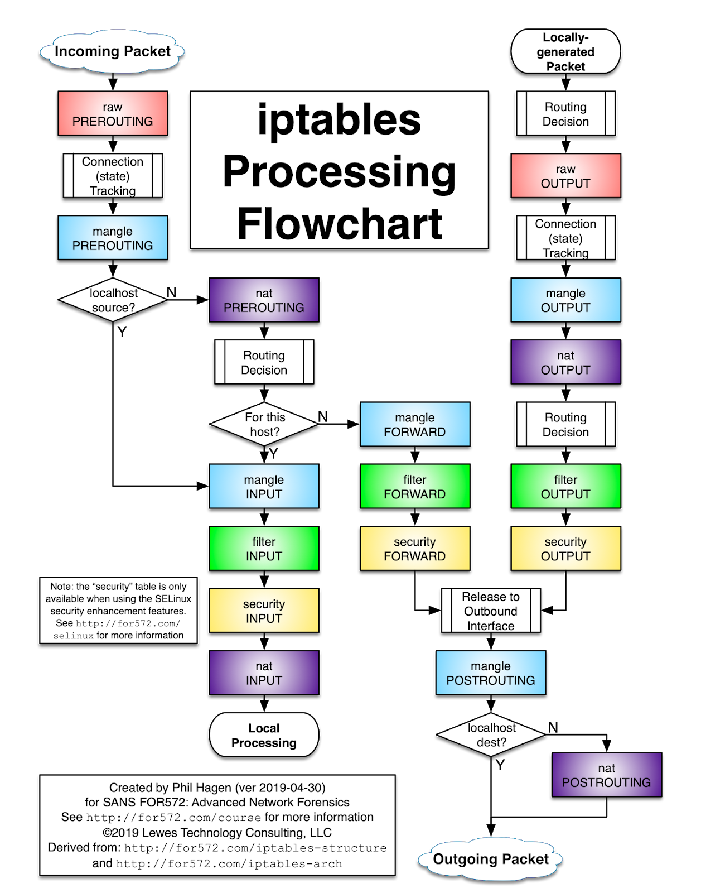

# Iptables Visualization

https://iptables.yessir.dev

**Just do it**

If you like it, give me a [⭐star](https://github.com/login?return_to=%2FSangHakLee%2Fiptables-visualization) or [❤️ sponsor](https://github.com/sponsors/SangHakLee)

## inspired
- https://github.com/AChingYo/iptables-graph
- 

## iptables-graph
https://github.com/SangHakLee/iptables-graph

If you want to directly convert iptables-save locally to png or dot (Graphviz), you can use this tool. This project also uses this tool.

## Maybe update...
- [x] svg file to view in browser(zoom in, out) **Preview**
- [x] svg to png
